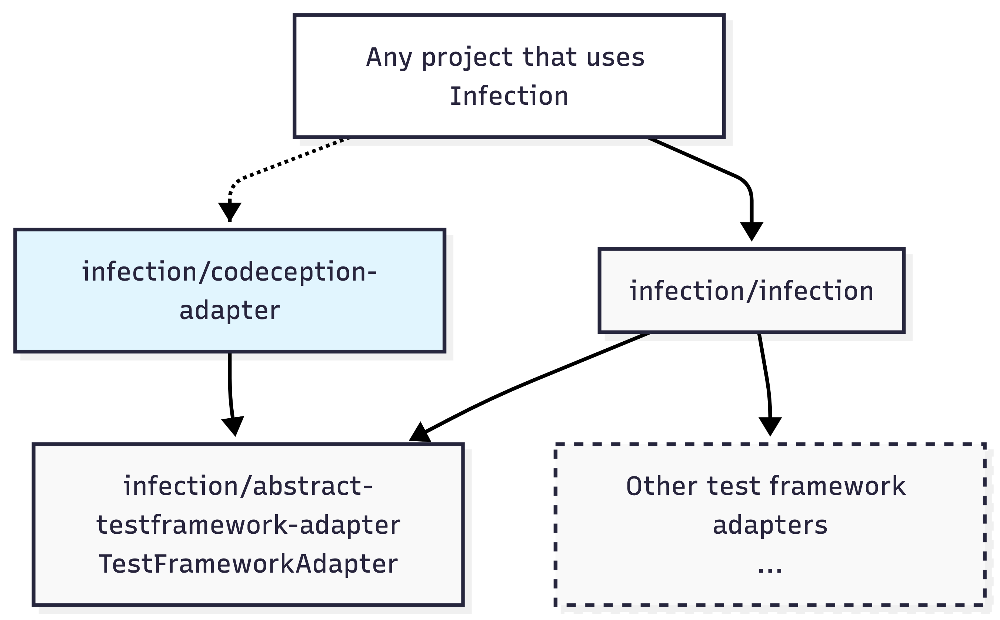

# Codeception Test Framework Adapter for Infection

This package provides the test framework adapter of [Codeception][codeception] for [infection][infection].



## Installation

In a standard usage, infection should detect [`codeception/codeception`][codeception] being used and
leverage its [`infection/extension-installer`][infection/extension-installer] to install this
package.

Otherwise, you can still install it as usual:

```shell
composer require --dev infection/codeception-adapter
```

The adapter will be automatically registered in Infection's runtime through its auto-discovery mechanism.

## Usage

Once installed, you can run Infection:

```shell
vendor/bin/infection # optional: --test-framework=codeception
```

Infection will automatically detect and use the [Codeception][codeception] adapter when [Codeception][codeception] is
configured in your project.

### Configuration

The adapter works with your existing PHPSpec configuration. No additional configuration is required beyond the standard
Infection configuration file `infection.json5.dist`.

For more information on configuring Infection, see the [Infection documentation][infection-configuration-docs].

## Contributing

Contributions are welcome! Please see [CONTRIBUTING.md](.github/CONTRIBUTING.md) for details.

## License

This project is licensed under the BSD 3-Clause License. See the [LICENSE](LICENSE) file for details.


[infection]: https://infection.github.io
[infection-configuration-docs]: https://infection.github.io/guide/usage.html#Configuration
[infection/extension-installer]: https://packagist.org/packages/infection/extension-installer
[codeception]: https://packagist.org/packages/codeception/codeception
